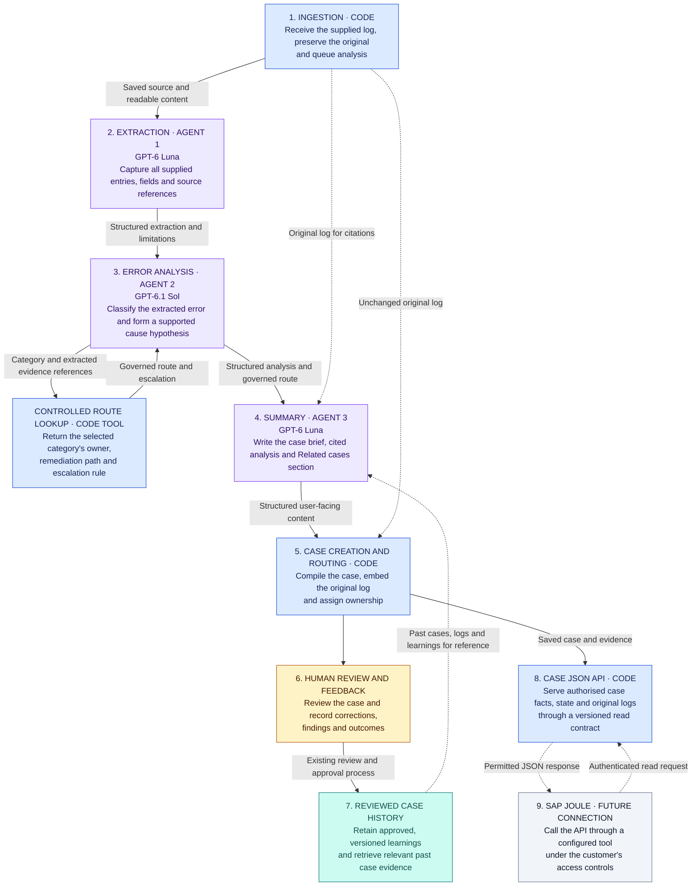

# AIF Resolution Workbench

Help finance support teams understand why a document failed and coordinate the work needed to resolve it.

Turn an SAP Application Interface Framework (AIF) log into a Central Finance (CFIN) case brief. AI explains the error and suggests next steps; people validate findings, approve changes and confirm the outcome.

## The problem

When a document fails on its way to CFIN, analysts need to know **what happened, who should act and what proves resolution**. Answers are scattered across logs, emails and previous investigations. Handoffs lose context, leading to repeated work and unclear ownership.

## Our solution

1. **Understand:** turn varied logs into a readable brief, with source-linked claims and causes marked for validation.
2. **Coordinate:** bring the owner, resolution steps, approvals and discussion into one case.
3. **Remember:** retain decisions, evidence and outcomes; use reviewed findings to inform similar cases.

AI interprets the logs. Software enforces access and workflow rules. People control business decisions.

## The experience

| Area | What users can do |
| --- | --- |
| **Dashboard** | See key metrics, upload a log and follow analysis progress before opening the completed case. |
| **Case Board** | Find cases by owner, status or date, and export the filtered list to CSV. |
| **Case workspace** | Read the summary, discuss the case, record decisions and inspect the original log. |

Each case has one owner and a status: **Open**, **In progress**, **Blocked** or **Closed**. Closure requires confirmed reprocessing, data validation and a proof screenshot.

Use sample data or a connected demo that saves cases, comments and files in Supabase. Personas and SAP proof are simulated; no SAP system is connected. See the [connected demo guide](docs/connected-demo.md).

## Architecture

Three agents extract facts, analyse the error and write the summary. Software selects the resolution path from maintained rules.



Blue represents software, purple represents AI agents, teal represents reviewed case history, and amber represents people. The grey SAP Joule connection is a future integration.

Past cases provide context, not proof of a new error's cause. An authenticated, read-only API exposes saved cases and evidence to other tools.

## Pilot scope

The pilot defines two resolution paths:

- **Master data:** request approval, create the required data, attach evidence, reprocess the document and confirm the CFIN posting.
- **Mapping:** confirm the correct mapping, record the change and evidence, obtain approval, reprocess and confirm the posting.

Data owners coordinate changes, finance process owners approve them, and Data Operations records reprocessing results. Other categories require human investigation; unsupported classifications remain **unclassified**.

Direct SAP access, automatic changes and the Joule connection are outside the pilot.

## Trust and learning

- Preserve original logs and cite evidence.
- Distinguish facts, hypotheses and human findings; show uncertainty.
- Require approval for governed changes and evidence for closure.
- Use only authorised, reviewed case history.

Corrections improve the case library and evaluation examples without automatically retraining models.

## Measuring success

We evaluate whether analysts understand and progress cases with less effort:

- **Quality:** complete extraction, correct classification and claims supported by evidence.
- **Usefulness:** time to understand a case, corrections needed and successful handovers.
- **Reliability:** completed workflows, failures, retries and response time.
- **Cost:** model usage and cost per completed case.

Synthetic examples test software behaviour. Real logs and analyst review are needed to measure model quality and user benefit.

## Latency optimisation

**Problem → change.** Models spent time copying log text and document details; cases
also queued for a single processing slot. Software now supplies those details while
AI interprets the errors, and two cases can run at once.

On the same ten synthetic logs, average wait fell **54%** and model cost fell **39%**.
All ten results and three additional difficult cases passed validation.

| Measure | Before | After | Trade-off |
| --- | ---: | ---: | --- |
| Average upload-to-result | 82.9 s | 37.9 s | Software must assemble complete, correctly cited results. |
| Average queue and startup | 29.0 s | 3.0 s | Higher simultaneous demand; capped at two cases. |
| Recorded model cost, ten logs | $0.447 | $0.272 | Source and document checks remain essential. |

**Model comparison.** We then tested four combinations on the same 13 logs.
All used **Luna medium extraction** and medium reasoning for analysis.
Sol = GPT-6.1 Sol; Luna = GPT-6 Luna.

| Analysis / writing | Average result wait | Cost, 13 runs | Main validation | Difficult-case repeat | Decision / trade-off |
| --- | ---: | ---: | --- | --- | --- |
| Sol / Sol medium | 40.2 s | $0.351 | 13/13 | Not run | Previous configuration; highest cost. |
| **Sol / Luna medium** | **37.2 s*** | **$0.158** | **12/13**; one extraction failure | **3/3** | **Selected for local demo**; large cost saving, modest overall speed gain. |
| Sol / Sol low | 35.1 s | $0.322 | 13/13 | 2/3; inconsistent confidence from analysis | Speed candidate; lead was not consistent on repeat. |
| Luna / Luna medium | 33.6 s | $0.035 | 12/13; high confidence despite unknown cause | Not run | Fastest and cheapest; confidence issue prevents selection on those metrics alone. |

*Wait averages cover completed results (12 for Luna writing); costs include failures
and retries. Validation means automated checks and source-based review. The three-case
repeats are separate from the main comparison. All 180 model-call traces across
58 analyses were verified in Arize.

**Decision.** Keep **Luna medium → Sol medium → Luna medium** for extraction,
analysis and writing. Across 12 matched completed cases, Luna writing cut writing
time **23%** and total model cost **51%**, but overall wait only **3%**. Extraction
failures and inconsistent confidence remain open issues, including with Sol analysis.
Broader model-output evaluation is still pending; these small synthetic tests guide
the next iteration.

Detailed evidence: [latency results](docs/latency-optimization-results.md) ·
[model comparison](docs/model-comparison-results.md).

## Technology

Next.js, React and Mantine power the interface. FastAPI and the OpenAI Agents SDK support the backend. Supabase provides data, authentication and storage foundations. Promptfoo supports evaluation, Arize supports tracing, and Docker/Railway configuration supports deployment.

## Run locally

Use Python 3.11+ with `uv` and Node 22. From the project folder:

```bash
make setup
make web
```

Open [the local workbench](http://127.0.0.1:3000). Run `make check` for lint, tests, typechecking, the frontend build and Railway configuration checks.

See [local development](docs/local-development.md) for environment setup and database checks.

## Further reading

- [Product design and operating rules](docs/product-design.md)
- [Frontend design](docs/FRONTEND_DESIGN.md)
- [Implementation plan](docs/RE-BUILD.md)
- [Validation notes](docs/repository-validation.md)
