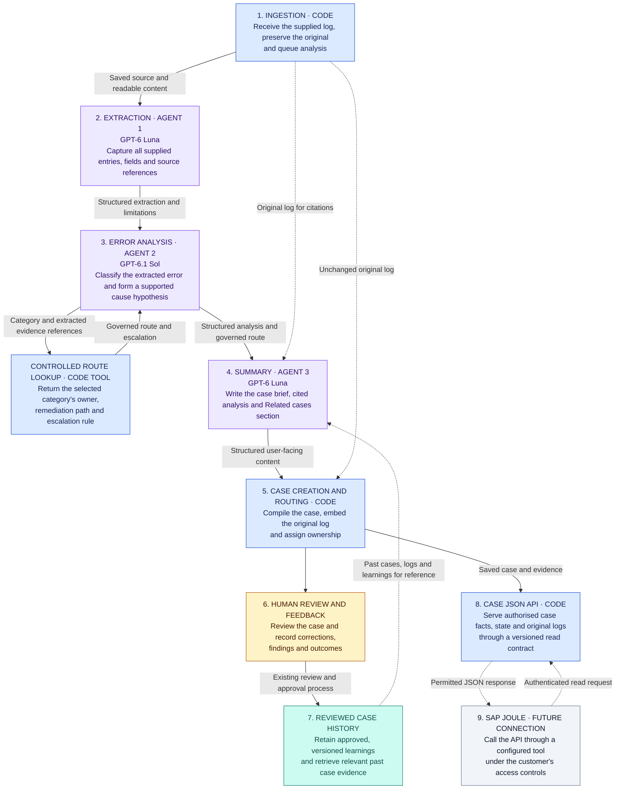

# AIF Resolution Workbench

Help finance support teams understand why a document failed and coordinate the work needed to resolve it.

The workbench turns an uploaded SAP Application Interface Framework (AIF) log into a clear case brief for Central Finance (CFIN). AI explains the reported error and suggests a resolution path. People validate the findings, approve changes and record the outcome.

## The problem

When a document fails on its way to Central Finance, a support analyst needs to answer three questions: **What happened? Who needs to act? What will confirm that the issue is resolved?**

The answers are often spread across technical log messages, document details, emails and previous investigations. A log can report an error, but someone still needs to interpret it, check the likely cause, find the right owner and coordinate approvals. Different log formats and incomplete information make this harder.

As a case moves between finance, data owners and operations, context can get lost. Teams may repeat an investigation or struggle to explain which change was approved and whether the document posted successfully. The product aims to reduce that effort and make each handover clear.

## Our solution

We have built an AI analysis backend and an interactive case-management demo around three jobs:

1. **Understand the failure.** The backend preserves the supplied log, extracts its facts, identifies an error category and prepares a readable brief. Important claims link back to the source, and a possible cause is clearly marked for human validation.
2. **Coordinate the next action.** The workbench brings the brief, named owner, resolution steps and case discussion together. Master-data and mapping cases have defined approval and remediation paths; other errors go to human investigation.
3. **Keep a useful record.** Comments, decisions, supporting evidence and outcomes stay with the case. Reviewed findings can help the Summary Agent explain similar cases in future.

AI helps interpret logs that vary in wording and structure. Software controls access and workflow rules, while people approve changes and confirm the outcome. The intended result is less time reconstructing the problem and a clearer path to a document successfully posted and validated in CFIN.

## The experience

| Area | What users can do |
| --- | --- |
| **Dashboard** | See key metrics, upload a log and follow analysis progress before opening the completed case. |
| **Case Board** | Find cases by owner, status or date, and export the filtered list to CSV. |
| **Case workspace** | Read the summary, discuss the case, record decisions and inspect the original log. |

Each case has one named owner and one of four statuses: **Open**, **In progress**, **Blocked** or **Closed**. Approvals and supporting files stay with the relevant message. Closing any case requires confirmation of successful reprocessing and data validation, plus a proof screenshot.

The workbench supports a local sample demo and a connected demo using the same interface. Connected mode saves cases, comments and file bytes in Supabase and displays published agent analysis. Personas and SAP proof are simulated; no SAP system is connected. See the [connected demo guide](docs/connected-demo.md) for setup and verification limits.

## Architecture

Three agents prepare the case: one extracts the facts, one analyses the error, and one writes the summary. Software selects the resolution path from maintained rules. People remain responsible for business decisions.



Blue represents software, purple represents AI agents, teal represents reviewed case history, and amber represents people. The grey SAP Joule connection is a future integration.

Past cases help the Summary Agent provide context. They do not establish the cause of a new error. An authenticated, read-only API makes saved cases and their evidence available to other tools.

## Pilot scope

The pilot defines two resolution paths:

- **Master data:** request approval, create the required data, attach evidence, reprocess the document and confirm the CFIN posting.
- **Mapping:** confirm the correct mapping, record the change and evidence, obtain approval, reprocess and confirm the posting.

The data owner coordinates the change, the finance process owner approves it, and Data Operations records reprocessing and posting results. Other error categories go to human investigation. Unsupported classifications remain **unclassified**.

The workbench records SAP work performed by people. Direct SAP access, automatic changes and the Joule connection are outside the pilot.

## Trust and learning

- Preserve the original log and link important claims to its evidence.
- Keep reported facts, possible causes and human findings distinct.
- Show missing information and uncertainty clearly.
- Require human approval for governed changes and evidence for closure.
- Use only authorised, reviewed past cases as historical context.

Human corrections improve the reviewed case library and evaluation examples. The product learns through better evidence and retrieval, rather than automatic model retraining.

## Measuring success

We evaluate whether analysts understand and progress cases with less effort:

- **Quality:** complete extraction, correct classification and claims supported by evidence.
- **Usefulness:** time to understand a case, corrections needed and successful handovers.
- **Reliability:** completed workflows, failures, retries and response time.
- **Cost:** model usage and cost per completed case.

Synthetic examples test software behaviour. Real logs and analyst review are needed to measure model quality and user benefit.

## Latency optimisation

**The problem.** Users waited an average of 82.9 seconds from upload to a case result
in our initial test. Two things contributed: the models spent time reproducing log
text and document details already available to the application, and cases waited
in a queue because only one could be analysed at a time. Writing alone took about
21 seconds; queueing and worker startup added another 29 seconds on average.

**What we changed.** We reduced the content the models had to generate. They now
identify relevant evidence, interpret the errors and write the explanation; the
application copies the exact source text and attaches document details. For example,
the model explains why an account lookup may have failed, while software supplies
the document number and original error message. We also enabled two cases to be
analysed concurrently.

On the same ten synthetic logs, average upload-to-result time fell from **82.9 to
37.9 seconds—a 54% reduction**. Analysis time fell from 51.9 to 33.1 seconds, and
recorded model cost fell **39%**. All ten outputs, plus three additional difficult
cases, passed automated checks and source-based review in that experiment.

**The trade-offs.** Moving repeatable work into software reduced generation time
and cost, but made the application responsible for assembling complete, correctly
cited results. We checked that document details and evidence survived that change.
Processing two cases at once reduced queueing but increased simultaneous resource
demand, so concurrency is capped at two. Lowering reasoning effort for extraction
and writing also looked faster, but one file failed extraction twice; we retained
medium reasoning in the selected configuration.

**What we learned from changing models.** A further 58 analyses compared model
combinations, with all 180 model-call traces verified in Arize. Using Luna for
writing cut that step's time by **23%** and total model cost by **51%** across the
12 cases it and the Sol-writing control both completed. However, total waiting
time improved only **3%** on those cases: extraction and retries still consumed
much of the time. A cheaper, faster writer does not remove every source of delay.

The table compares the same 13 logs using a fresh run of the previous configuration.
Every option used Luna medium for extraction; only analysis and writing varied.

| Analysis | Writing | Average wait for a result | Recorded cost, 13 runs | Passed validation |
| --- | --- | ---: | ---: | --- |
| Sol medium | Sol medium — previous | 40.2 s | $0.351 | 13/13 |
| Sol medium | Luna medium — selected | 37.2 s* | $0.158 | 12/13; one extraction failure |
| Sol medium | Sol low | 35.1 s | $0.322 | 13/13 |
| Luna medium | Luna medium | 33.6 s | $0.035 | 12/13; one confidence issue |

*The Luna-writing average covers its 12 completed results; cost includes the failed
run. In a separate repeat of three difficult logs, Luna writing passed 3/3 and
Sol low writing passed 2/3: Sol analysis also produced an inconsistent confidence
label. Validation here means automated evidence checks and source-based output
review, not completion of the broader model-output evaluation.

The local demo now uses **Luna medium for extraction, Sol medium for analysis, and
Luna medium for writing** for new uploads. This is the selected configuration for
the next model-output evaluation. Occasional extraction failures and confidence
labels that contradicted an unknown cause, including with Sol analysis, remain
open issues. Switching models does not resolve them. These are small synthetic
experiments; we will update the decision as broader evaluation evidence grows.

See the [latency results](docs/latency-optimization-results.md) and
[model comparison](docs/model-comparison-results.md) for measurements, failures and
evaluation limits.

## Technology

Next.js, React and Mantine power the interface. FastAPI and the OpenAI Agents SDK support the backend. Supabase provides data, authentication and storage foundations. Promptfoo supports evaluation, Arize supports tracing, and Docker/Railway configuration supports deployment.

## Run locally

Use Python 3.11+ with `uv` and Node 22. From the project folder:

```bash
make setup
make web
```

Open [the local workbench](http://127.0.0.1:3000). Run `make check` for lint, tests, typechecking, the frontend build and Railway configuration checks.

See [local development](docs/local-development.md) for environment setup and database checks.

## Further reading

- [Product design and operating rules](docs/product-design.md)
- [Frontend design](docs/FRONTEND_DESIGN.md)
- [Implementation plan](docs/RE-BUILD.md)
- [Validation notes](docs/repository-validation.md)
