# Technical architecture: controlled error-analysis pilot

**Status: approved target architecture, not the current production workflow — 2 October 2026.** The running rebuild remains the factual-only `log-only-v1` pipeline. This document defines the next implementation revision: Error Analysis, controlled routing and a rendered investigator case. It does not authorise SAP access, automatic changes, approval, or reprocessing.

## Purpose and design decisions

The system receives a supplied SAP AIF error log and produces a reviewable exception case. Code owns durable intake, access, policy, retrieval, persistence and state changes. Agents interpret bounded evidence and generate structured handoffs. People validate causes, approve changes, add evidence, and record reprocessing outcomes.

| Decision | Architecture consequence |
| --- | --- |
| Raw AIF content is the primary evidence. | Store the original immutable source separately from every derived result, with source version, SHA-256 and line locations. |
| Extraction stays unchanged. | Agent 1 receives the readable original and returns a comprehensive structured extraction with source references. |
| Error Analysis does **not** get the original log or case history. | Agent 2 receives only Agent 1's validated extraction and its source-reference identifiers. It cannot use raw text, SAP, historical cases or a general search tool. |
| Only `master_data` and `mapping` are active initially. | Agent 2 may return an active category or `unclassified`; all other known categories are inactive and route to manual investigation. |
| Owners, approval steps and escalation are policy, not model judgment. | A code-owned, versioned route registry returns the only permitted route for a selected category. Prompt text can describe the taxonomy but cannot be the policy source of truth. |
| The case is a readable investigator brief. | Agent 3 returns a Pydantic-validated content model; code renders it as a case page rather than exposing generated JSON as the user experience. |
| Similar cases help investigation but do not establish the present cause. | Code retrieves a small, authorised candidate set before Agent 3 runs. The agent may cite a case only with shared facts and material differences. |

## Target system

```mermaid
flowchart LR
    U["CFIN analyst / Process Owner"] --> FE["Next.js case board"]
    AIF["AIF log file or future AIF feed"] --> API["FastAPI intake API"]
    FE --> API

    API --> S["Private object storage\nimmutable originals"]
    API --> DB["Supabase Postgres\ncases, runs, policy, activity"]
    API --> Q["Durable run queue"]

    Q --> W["Python worker\nlease + cost guard"]
    S --> X["Agent 1: Extraction\nraw log + source locations"]
    X --> E["Validated extraction snapshot"]
    E --> EA["Agent 2: Error Analysis\nstructured extraction only"]
    EA --> RL["Route lookup service\nversioned taxonomy registry"]
    RL --> AN["Validated analysis package"]

    E --> HR["Similar-case retrieval service\nauthorised, bounded query"]
    AN --> HR
    HR --> HC["Eligible historical evidence"]
    S --> SA["Agent 3: Summary\noriginal for citations"]
    AN --> SA
    HC --> SA
    SA --> CB["Validated case-brief model"]

    CB --> DB
    DB --> FE
    FE --> H["Human approval, evidence, comments\nand reprocessing result"]
    H --> DB

    DB --> READ["Versioned saved-case read API"]
    S --> READ
    READ -. authorised read .-> EXT["Future external consumer\nfor example SAP Joule"]

    W -. traces, latency, cost .-> OBS["Arize AX observability"]
    DB -. audit and run state .-> OBS
```

The worker is the only component that can call models. The browser never receives an OpenAI key, a service-role credential, hidden route policy, or another workspace's data. The saved-case read API is read-only: it reads already published snapshots and cannot invoke an agent or alter case state.

## Component responsibilities

| Component | Responsibility | Must not do |
| --- | --- | --- |
| **Next.js case board** | Upload a log, show the rendered case, show exact evidence links, collect human activity and show state. | Decide category, approval, route or resolution. |
| **FastAPI application** | Authenticate/authorise users, validate input, create idempotent intakes, return saved cases, and enforce workflow writes. | Send credentials or raw unrestricted data to the browser. |
| **Private storage** | Preserve original bytes and readable representations, independently hash-verified. | Silently transform, overwrite or make originals public. |
| **Supabase Postgres** | Persist case state, source manifests, immutable run snapshots, route-policy versions, retrieval snapshots, case activity and access audit. | Treat model prose as a human approval or an SAP result. |
| **Durable worker** | Claim a leased run, restore exact inputs, call each bounded stage, validate/persist stage outputs, and publish only a complete valid result. | Run a model without a budget reservation or overwrite a newer human update. |
| **Agent 1 — Extraction** | Capture supplied log entries, fields, message data, ambiguity and original source spans. | Infer current SAP state, recommend a change or omit unfamiliar data because it is hard to classify. |
| **Agent 2 — Error Analysis** | Classify from the structured extraction, state a cause hypothesis, cite extraction entry IDs and gaps, then request the route lookup. | Read original logs/history, choose a mapping value, make SAP changes, assign a person, approve work or claim a confirmed root cause. |
| **Route lookup service** | Resolve a valid `category_id` against the active registry and workspace configuration. Return owner role, route, approval requirements and escalation. | Expose arbitrary SAP actions or accept an agent-supplied owner/remediation. |
| **Similar-case retrieval service** | Build a permission-filtered, bounded query and load exact approved case evidence for candidates. | Send history to Agent 1/2 or treat a similarity score as proof. |
| **Agent 3 — Summary** | Produce the rendered-case content from analysis, original citations and returned historical evidence. | Reclassify the error, invent a route, hide uncertainty or execute case actions. |
| **Human workflow** | Validate/refute the hypothesis, obtain approval, perform controlled changes, upload evidence and record outcomes. | Be bypassed by generated text or a route lookup. |

## Data boundaries and handoffs

Every model handoff is a frozen, Pydantic-validated snapshot linked to a case, run, source-manifest hash, model configuration, prompt version and schema version. Reference validation ensures IDs exist; it does not prove semantic accuracy. The source of truth is always the preserved original.

| Handoff | Producer → consumer | Contents | Deliberately excluded |
| --- | --- | --- | --- |
| `ExtractionResult` | Agent 1 → Agent 2 | Every extracted entry, logged fields, exact text captured per entry, source span, ambiguity and extraction limitations. | Historical material, human conclusions, SAP lookups and remediation instructions. |
| `ErrorAnalysis` | Agent 2 → route lookup → Agent 3 | `category_id`, category status, confidence, cause hypothesis, supporting extraction entry IDs, competing explanations/gaps, and returned route-policy reference. | Raw original content, historical cases, SAP state, an invented person or invented fix. |
| `RouteDefinition` | Registry → Agent 2/3 and workflow | Policy version, default owner role, approval sequence, required evidence, human remediation steps, reprocessing responsibility and escalation condition. | General-purpose write tools, credentials, or an unbounded list of staff. |
| `HistoryRetrievalResult` | Retrieval service → Agent 3 | Search status, bounded eligible candidates, case/version IDs, cited source material and access-safe excerpts. | Withdrawn/inaccessible records, future findings for the current case, and result data for Agents 1/2. |
| `CaseBrief` | Agent 3 → renderer/case creation | Title, facts, context, original-log citations, analysis label, governed next steps, related cases, blockers and open questions. | Case-state updates, human approval, unverified historical claims, or a self-assigned resolution. |

The original log follows two controlled paths: Agent 1 reads it to extract facts, and Agent 3 reads it solely to make precise citations and verify its presentation. This is intentional. Agent 2 is isolated from the original so its diagnosis is grounded in the agreed structured extraction rather than selectively rereading prose.

## Taxonomy and route registry

The registry is a versioned application configuration, scoped to the workspace. It is loaded by code, validated at deployment, and written to the run snapshot so an old case always retains the policy it was created under. The ten documented families remain available as controlled vocabulary. Only two records are `active` in the pilot.

| Category | Pilot state | Default owner | Route outcome |
| --- | --- | --- | --- |
| `master_data` | Active | MDG Process Owner | Process Owner approval → MDG Process Owner creates data and attaches evidence → Data Operations reprocesses and records the CFIN result. |
| `mapping` | Active | MDG Process Owner | Process Owner confirms correct mapping → MDG Process Owner maintains it and attaches evidence → Process Owner approval → Data Operations reprocesses and records the result. |
| Other eight categories and `unclassified` | Inactive/manual | CFIN Exception Manager | Manual assignment and investigation; no generated remediation route. |

An active-route record needs at least: `category_id`, `policy_version`, `status`, `owner_role`, `approval_roles`, ordered human steps, required evidence types, `reprocessing_role`, and explicit escalation triggers. The registry rejects a route without these fields. The model can suggest only an allowed category; code resolves all routing details.

## Processing sequence

1. **Intake:** API validates file type/size and duplicate key, stores original bytes, verifies read-back and creates a source manifest plus queued run.
2. **Extraction:** worker restores exact saved bytes, invokes Agent 1 and validates every entry/location against the manifest. Unreadable or incomplete material becomes an explicit limitation.
3. **Error Analysis:** worker supplies the validated `ExtractionResult` only. Agent 2 returns a controlled category or `unclassified`, a tentative hypothesis, evidence references and gaps.
4. **Route resolution:** code rejects inactive/unknown categories for automated routing, resolves the active registry record, and snapshots the returned policy.
5. **Historical retrieval:** code uses `category_id` as the primary filter, then narrows candidates with error/object identity, source/target system, interface, company/organisation, safe document attributes and previous outcome. It enforces workspace access, review eligibility and withdrawal before loading a small ranked set.
6. **Summary:** Agent 3 receives the analysis, route definition, original log/source locations and only the retrieved authorised candidates. It writes the readable case. It may return no related cases.
7. **Publication:** code validates citations, persists immutable output snapshots, builds the case projection and records owner-role/approval state. Failed or incomplete runs stay visible as failures; no partial brief is published as complete.
8. **Human work:** the case board records approval/rejection, implemented change evidence, reprocess request and actual CFIN outcome as attributed activity. A successful retry or confirmed root cause can only be recorded by the appropriate human/workflow integration.

## Rendered case contract

The page is a presentation of `CaseBrief`, not a raw agent response. The required sections are:

1. **Title and tags:** error type, owner role, route/approval state and human-validation state.
2. **What happened:** factual description of the reported failure.
3. **Document and processing context:** document number, source/target systems, company, interface, attempt, timestamp and logged outcome when supplied.
4. **Evidence from the original log:** concise factual statements with source file and line references.
5. **Error assessment:** category, tentative cause hypothesis, confidence and material gaps. It must say that human validation is pending.
6. **Required next steps and escalation:** the registry-returned human route, never a model-authored SAP instruction.
7. **Similar earlier cases:** zero or more separately cited cases, each with relevant common facts and material differences.
8. **Open questions/blockers:** missing evidence, approval state, ambiguous extraction, failed reprocessing or manual assignment need.
9. **Case activity:** authored human comments, approvals, attachments and reprocess records; it is not generated prose.

## Security, reliability and cost controls

| Risk | Control |
| --- | --- |
| Prompt injection in logs or historical records | Treat all supplied/historical text as data. Stage prompts prohibit following embedded instructions; no stage receives write tools or secrets. |
| Data leakage across cases/workspaces | Enforce membership and row-level policies at every API/retrieval read; filter candidates before model input; do not give a related-case citation implicit access. |
| Invented diagnosis/owner/fix | Pydantic schemas constrain labels and entry references; code-owned registry provides route facts; display hypothesis and uncertainty separately from human findings. |
| Corrupted/replayed processing | Hash immutable originals, bind snapshots to source/run versions, use idempotency keys, queue leases, stage checkpoints and optimistic case-version writes. |
| Provider/schema/timeout failure | Use per-stage deadline, bounded retry after validation/transient failure, explicit failure state and safe resume from valid checkpoints. Do not publish when usage or output validity is unknown. |
| Uncontrolled model spend | Reserve cost before each stage, reconcile actual usage, enforce the existing US$1/run and US$10/month limits, and leave paid dispatch explicitly gated. |
| Excessive historical context | Retrieval has a fixed candidate and excerpt limit, carries source versions, and allows an honest `unavailable`/`no similar cases` result. |
| Sensitive telemetry | Keep business audit/run state in Postgres. Configure Arize traces with minimal identifiers and redacted payloads; never put raw logs, access tokens or service credentials in telemetry. |

## Evaluation and observability

The refresh should add stage-level tests before enabling the route. Use **Promptfoo** for repeatable fixture and adversarial regression suites; use **Arize AX** for operational traces, latency, cost and sampled quality review. Neither a passing schema test nor a trace receipt proves a correct diagnosis.

| Stage | Acceptance measures |
| --- | --- |
| Extraction | Field/entry coverage, source-location validity, exact identifier preservation, limitations surfaced, and resistance to embedded instructions. |
| Error Analysis | Correct active-category or `unclassified` selection, supported hypothesis, valid extraction references, no raw/history dependency and no unauthorised remediation. |
| Route lookup | Category/status/version resolution, complete active route, inactive fallback and tamper rejection. |
| Summary | Factual citation precision, facts/hypothesis/route separation, useful context completeness, no invented actions, and accurate similar-case differences. |
| End-to-end | Human reviewer accuracy/actionability rubric, approval-path completion, reprocess outcome recording, latency, cost, stage recovery and cross-workspace denial. |

Monitor run completion and failure by stage, extraction coverage limitations, category distribution including `unclassified`, route/escalation frequency, human corrections, time to owner acknowledgement, approval/reprocess completion, citation defects, retrieval usefulness, p50/p95 latency and cost per completed case. Review cases where a human changes the category or rejects the hypothesis; they are the most valuable source for improving prompts, taxonomy policy and evaluation fixtures.

## Delivery sequence

1. Add versioned Pydantic contracts and database migration for `ErrorAnalysis`, route-policy snapshots, case brief sections and retrieval query/version metadata.
2. Add the registry and deterministic route-lookup service, seeded only with the two active pilot categories and their human escalation rules.
3. Replace factual Agent 2 selection with isolated Error Analysis; adapt durable checkpoint validation and replay tests.
4. Move historical query construction to code after analysis, then pass bounded authorised results only to Agent 3.
5. Update the renderer and case controls for category/owner tags, approval state, required evidence, escalation and human reprocessing records.
6. Add Promptfoo stage/end-to-end suites, Arize redacted observability, migration tests and human-reviewed pilot fixtures.
7. Run local acceptance, then obtain explicit approval before applying the hosted migration or enabling paid-model execution. Roll out behind a separate workflow-version/gate and retain factual-only cases unchanged.

## Out of scope for this revision

- Direct SAP, AIF or master-data/mapping writes.
- Model-selected mapping values, data creation, approvals, reprocessing or resolution.
- Automatic activation of the other eight taxonomy categories.
- A live SAP Joule integration or external write API.
- Automatic learning/model training from case feedback.

The corresponding product-level workflow, active routes and readable case template are maintained in the [README](../README.md). The implementation record remains the source for what has actually been built and verified.
